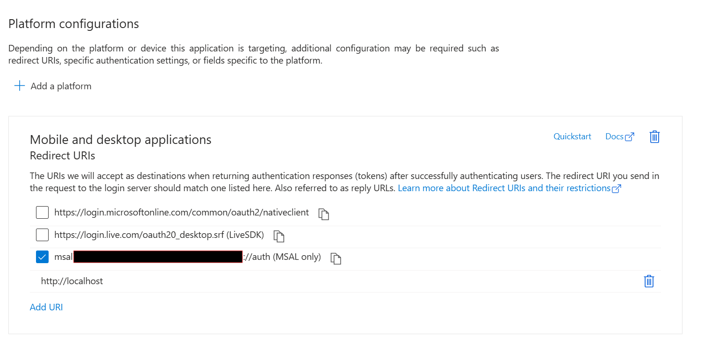

# My-MdeMigration

```bash
                               _             _                 _   _             
  /\/\  _   _        /\/\   __| | ___  /\/\ (_) __ _ _ __ __ _| |_(_) ___  _ __  
 /    \| | | |_____ /    \ / _` |/ _ \/    \| |/ _` | '__/ _` | __| |/ _ \| '_ \ 
/ /\/\ \ |_| |_____/ /\/\ \ (_| |  __/ /\/\ \ | (_| | | | (_| | |_| | (_) | | | |
\/    \/\__, |     \/    \/\__,_|\___\/    \/_|\__, |_|  \__,_|\__|_|\___/|_| |_|
        |___/                                  |___/                             
```

## Required Modules

Microsoft Graph Powershell SDK must be installed in order to utilize this module.

```powershell
[ps]> Install-Module Microsoft.Graph -Scope AllUsers -Repository PSGallery -Force
```

## Install My-MdeMigration Module

1. If you don't have one already, create a `WindowsPowerShell` folder in your **Documents** folder
1. If you don't have one already, create a `Modules` folder inside the **WindowsPowerShell** folder created in **Previous Step**
1. Clone this repository to the **Modules** folder created in **Previous Step**

```powershell
[Documents\WindowsPowerShell\Modules]> git clone https://github.com/dmcwee/my-mdemigration.git .
```
> The module folder includes an install script to create a self signed certificate and sign the module. The install must be run in a powershell window with `bypass` or another permissive execution policy. After running the install script the module can be run with an execution policy that allows for self signed certificates.

1. Launch a Powershell with *ExecutionPolicy Bypass* window and navigate to the `Documents\WindowsPowerShell\Modules\my-mdemigration` folder.
1. Run the `install.ps1` script.
1. When prompted for the root certificate install choose **Yes**
1. The module will now be locally signed and trusted and will run with the **ExecutionPolicy AllSigned**

```powershell
[ps]> powershell -executionpolicy bypass
[ps]> cd Documents\WindowsPowerShell\Modules
[PowerShell Module Folder]> install.ps1
```

## After Installation

The next items outline actions you should perform after install the My-MdeMigration module.

### Register an Entra Application

You should use a registered application in your organization's Entra Tenant to limit and monitor the scopes
used by My-MdeMigration module. Follow [these instructions](https://learn.microsoft.com/en-us/powershell/microsoftgraph/authentication-commands?view=graph-powershell-1.0#use-delegated-access-with-a-custom-application-for-microsoft-graph-powershell) to create a local application.

On the App Registration's Authentication page be sure to add the **Mobile and desktop applications** platform, and `http://localhost` as one of the URIs.



The Client Id and Tenant Id will be necesary when running the module's Import commands.

## Usage

> PowerShell's `Get-Help` is implemented for all public functions of the module.

Currently the primary use case for My-MdeMigration module is to accelerate the ability of organizations to create
Microsoft Defender Antivirus Exclusion policies.

### Import-MyMdeCsvExclusions

The Import-MyMdeCsvExclusions accepts a CSV file, Policy Name, ClientId, TenantId, Target OS, and the ExcludeDefaults switch.

> **Note:** Running in Debug will cause a JSON file of the policy to be generated in the local directory.

**NEW:** Using the ExcludeDefaults switch will automatically check the exclusion paths against the default set of exclusions for MDE Windows Server features and if a match exists then the path will not be included as part of the policy when it is created. *Warning:* Some checks are performed for folder level exclusions when file exclusions are specified by the MDE Exclusion documentation, but may still be necessary in an environment. Users should review the policies after import for any potential omissions.

The CSV file should be formatted as follows:

```csv
Exclusion,ExclusionType
/usr/bin/mysql, Process
/usr/mysql/data, Directory
mdf, FileExt
/usr/mysql/backup/backup.bak, File
```

#### Valid ExclusionType

* Process
* Directory
* FileExt
* File

#### Valid OsFamilies

* Windows
* Linux
* Mac

### Import-MyMdeExclusions

The Import-MyMdeExclusions accepts a file with a list, one entry per line, of exclusion (File Extension, Directory, File, Process) and will
generate a valid Microsoft Defender Antivirus Exclusion policy in the MDE service.

> **Note:** Running in Debug will cause a JSON file of the policy to be generated in the local directory.

**NEW:** Using the ExcludeDefaults switch will automatically check the exclusion paths against the default set of exclusions for MDE Windows Server features and if a match exists then the path will not be included as part of the policy when it is created. *Warning:* Some checks are performed for folder level exclusions when file exclusions are specified by the MDE Exclusion documentation, but may still be necessary in an environment. Users should review the policies after import for any potential omissions.
